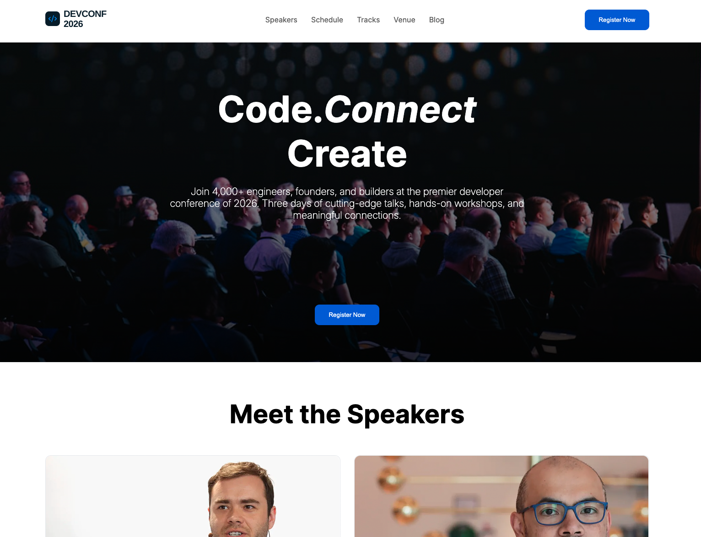

# DevConf 2026 — Conference Landing Page

A modern, responsive conference landing page built as a frontend development project.

The project focuses on creating a clean developer-conference experience with a strong visual hierarchy, responsive layouts, speaker profiles, pricing plans, and clear calls to action.

## 🌐 Live Demo

**[View Live Website](https://almamuncode.github.io/a01-devconf-2026/)**

---

## 📸 Preview



---

## ✨ Features

- Responsive navigation bar
- Hero/banner section with conference CTA
- Speaker showcase with speaker categories
- Responsive speaker card grid
- Conference pricing section
- Standard, Pro, and Team pricing plans
- Featured pricing plan styling
- Conference benefits / feature section
- Responsive layout for different screen sizes
- Clean and reusable HTML/CSS structure
- GitHub Pages deployment

---

## 🛠️ Technologies Used

- **HTML5** — Semantic page structure
- **CSS3** — Styling, layouts, responsiveness, and visual effects
- **Figma** — UI design reference and layout planning
- **Git & GitHub** — Version control and project hosting
- **GitHub Pages** — Deployment

> No JavaScript or CSS framework was used in this project.

---

## 📂 Project Structure

```text
a01-devconf-2026/
│
├── assets/
│   ├── images/
│   └── ...
│
├── ui/
│   └── ...
│
├── index.html
├── style.css
├── DevConf2026.fig
├── PROMPTS.md
└── README.md
```

---

## 🚀 Getting Started

### 1. Clone the repository

```bash
git clone https://github.com/almamuncode/a01-devconf-2026.git
```

### 2. Navigate to the project

```bash
cd a01-devconf-2026
```

### 3. Open the project

This is a static HTML/CSS project, so no package installation is required.

You can open `index.html` directly in your browser.

For a better development experience, use **VS Code with Live Server** or another local development server.

---

## 💻 Run with VS Code Live Server

1. Open the project in VS Code.
2. Install the **Live Server** extension.
3. Right-click `index.html`.
4. Select **Open with Live Server**.

The project will open in your browser.

---

## 📱 Responsive Design

The website is designed to provide a responsive experience across:

- Desktop
- Laptop
- Tablet
- Mobile devices

The layout adapts sections, cards, navigation, typography, spacing, and other elements according to the screen size.

---

## 🎨 Design & Development

The project was developed from a provided conference UI design and implemented using semantic HTML5 and CSS3.

Special attention was given to:

- Visual hierarchy
- Typography
- Spacing
- Responsive layouts
- Card-based UI
- Call-to-action placement
- Consistent styling
- Mobile responsiveness

---

## 🤖 AI-Assisted Development

As part of the project requirements, AI was used to assist with ideation and development of the additional section.

The prompts used during the process are documented in:

**[`PROMPTS.md`](./PROMPTS.md)**

---

## 🚀 Deployment

The website is deployed using **GitHub Pages**.

### Live Website

**[https://almamuncode.github.io/a01-devconf-2026/](https://almamuncode.github.io/a01-devconf-2026/)**

---

## 📚 What I Learned

Through this project, I practiced:

- Writing semantic HTML
- Building layouts with CSS
- Creating responsive designs
- Working with CSS media queries
- Structuring reusable UI sections
- Managing project assets
- Using Git and GitHub effectively
- Deploying static websites with GitHub Pages
- Translating a visual design into a functional website

---

## 👨‍💻 Author

**Md Al Mamun**

Junior Developer with a professional background in graphic and UI design.

- Portfolio: [almamuncool.com](https://www.almamuncool.com)
- GitHub: [@almamuncode](https://github.com/almamuncode)

---

## 📄 License

This project was created for educational and portfolio purposes.
